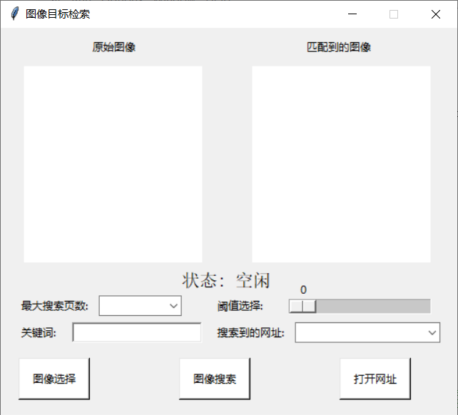
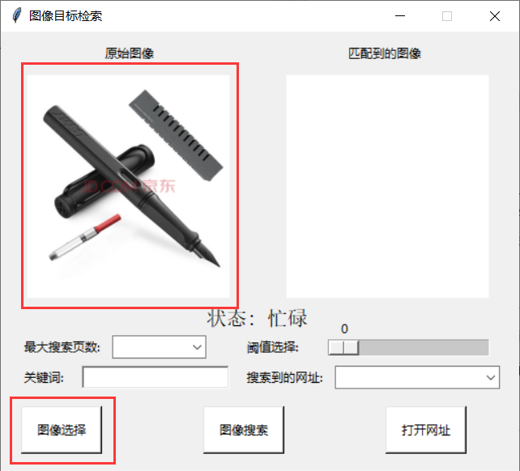
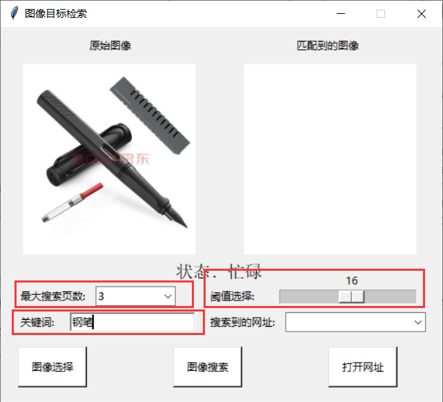
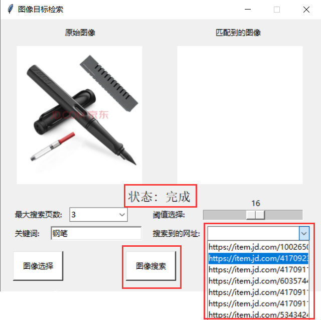
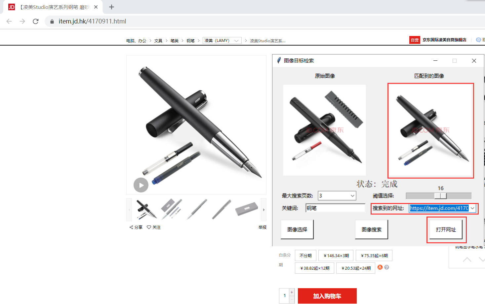

# 京东商城上的图像目标检索
信号与系统自选实验

## 版本及库依赖
- python版本3.6
- cv2
- numpy
- PIL
- requests
- io
- matplotlib
- tkinter
- urllib
- re
- webbrowser
- warnings

## 程序架构
- 特征值计算模块-均值哈希算法与差值哈希算法
- 爬虫模块
- 相似度计算模块
- GUI界面及信息显示模块

## 主要函数
### object_search类
用于在京东商城上进行图像检索，包含以下函数：

- search_onWeb函数:根据关键词在京东网页上搜索商品的图像，并将搜索到的图像和目标图像进行相似度计算，如果相似就保存该商品的网址
- ad_Hash函数:通过均值哈希算法与差值哈希算法计算出图像的特征直方图
- compare函数:根据两个图像的特征直方图计算两个图像的相似度
- get_img1函数:获取待搜索的目标图像
- get_img2函数:获取搜索到的网页上的图像
- __init__:object_search对象的初始化
- show_img函数:在对应图像框内显示图像

### getImageByUrl函数
用于读取网页上的图像

### openfile_dialog函数
按键响应函数，通过文件对话框选择目标图像

### choose_web函数
下拉列表控件的响应函数，下拉列表选择某一个搜索到的商品网址时，通过该函数可以将这个商品的图像显示在图相框内

### set_Threshold函数
进度条控件的响应函数，拉动进度条后通过这个函数改变哈希算法的阈值

### OpenWeb函数
按键响应函数，通过网址打开浏览器

### gui_init函数
初始化GUI界面

## 操作方法
运行JingDong_IMGsearch.py后会弹出如下的GUI界面：

进行一次搜索主要包含以下四个步骤：

step1.首先点击“图像选择”按钮，在文件夹中选择自己需要搜索的图像。注意一定要是英文路径！否则打开图像时会报错。正确打开后左上角的第一个图像框就会显示你选中的图像。

step2.图像选择完毕后就要开始设置搜索的参数，包括“最大搜索页数”、“阈值选择”和“关键词”。其中“关键词”一栏为必填项，其余两个为选填项，因为它们带有初始的默认值。“关键词”一栏就填需要搜索的关键词，比如想搜索手机就填写“手机”。“最大搜索页数”是指在京东网页上要搜索多少页，默认是10页，页数越多算法所消耗的时间越多。“阈值选择”是调节哈希算法进行相似度计算的阈值，阈值越小匹配的越精确，但是匹配到的商品越少，阈值越大匹配到的商品多，但是匹配的图像可能不精确，默认设置为20。

step3.上述参数设置完毕后点击“图像搜索”按键。状态栏的“空闲”将会转化为“忙碌”。搜索完成后会将状态栏的“忙碌”转化为“完成”。

step4.状态栏显示“完成后”，就可以在“搜索到的网址”一栏中查找搜索的结果。如果点击它的下拉按钮发现为空，则证明没有搜索到符合条件的商品，可以返回step2将阈值设置大一点。如果不为空，则可以任意选中其中一个网址，选中后右上角的第二个图像框就会显示你选中商品的图像。点击右下角的“打开网址”按键就会用你的默认浏览器打开当前网址。

<注>如果上述流程操作无误但是程序报错，可能是设置的最大搜索页数太大，但是京东网页上并没有那么多页。建议的参数选择:最大搜索页数4，阈值选择15。也有可能是京东的网页源码的规律有变，这时就需要读者自行修改匹配网址的正则表达式，其中匹配图像网址的正则表达式为object_search类的self.pat变量（代码第152行），匹配当前商品网址的正则表达式为object_search类的web_pat变量（代码第47行）。

## 贡献者
- Junpeng Chen ([@bird1and1fish](https://github.com/bird1and1fish))